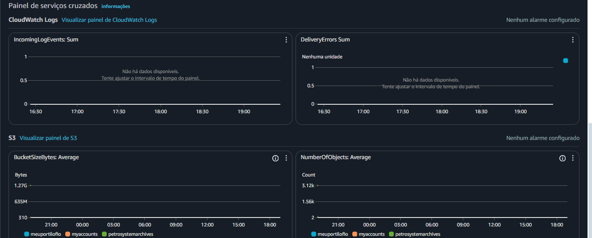
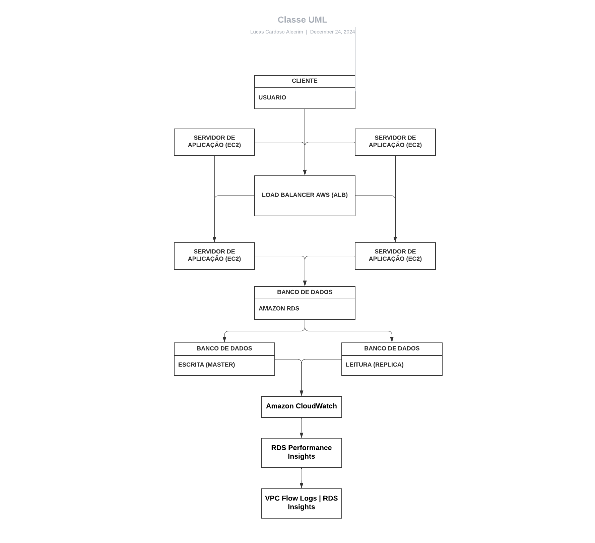
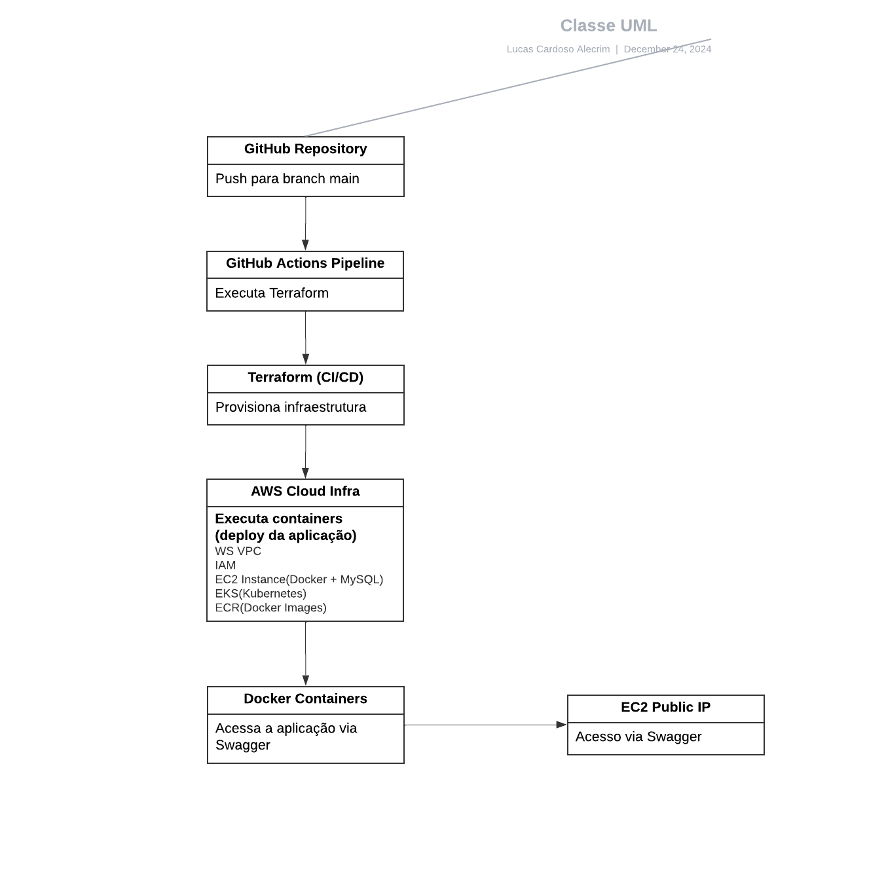

<p align="center">
  
</p>

# **Valcann Programa de estágio** 

# **Problema 1 | Automação de Ambientes Operacionais** 

Este projeto é um script em Python para automatizar tarefas de gerenciamento de backups. Ele realiza as seguintes ações:

1. **Listar Arquivos**: Lista todos os arquivos em um diretório de origem, com detalhes como nome, tamanho, data de criação e data da última modificação. O resultado é salvo em um arquivo de log.  
2. **Excluir Arquivos Antigos**: Remove arquivos com mais de 3 dias da pasta de origem.  
3. **Copiar Arquivos Recentes**: Move arquivos com menos de 3 dias para um diretório de destino.  
4. **Gerar Logs**: Salva os detalhes dos arquivos em arquivos de log separados para as pastas de origem e destino.  
5. **Seleção de Diretórios**: Utiliza um popup para selecionar o diretório de origem.

## **Estrutura do Projeto**

* `script.py`: Arquivo principal com o código do script.  
* `logs/`: Diretório onde os arquivos de log serão salvos.  
  * `bckpExemplo.log`: Log dos arquivos processados.

## **Requisitos**

Para executar este script, é necessário ter o Python 3 instalado e as dependências abaixo:

### **Dependências**

* `tkinter`: Utilizado para abrir a interface de seleção de pastas.  
* `shutil`: Biblioteca padrão para manipulação de arquivos e diretórios.

### **OBS:** O tkinter é parte da biblioteca padrão do Python e geralmente vem pré-instalado, mas se caso não estiver coloquei um requirements.txt 

Instale as dependências com o comando abaixo:
```bash
pip install \-r requirements.txt
```
Conteúdo do arquivo `requirements.txt`:
```
tk
```
## **Como Usar**

1. **Configuração do Ambiente**:  
   * Certifique-se de que o diretório de destino (padrão: `temp`) existe ou permita que o script o crie automaticamente.  
2. **Execução do Script**:  
   * Execute o arquivo `script.py`:  
  ```bash
     python script.py  
  ```
3. **Interação**:  
   * Um popup será exibido para selecionar o diretório de origem no seu disco C.  
4. **Resultados**:  
   * Arquivos antigos serão excluídos do diretório de origem.  
   * Arquivos recentes serão copiados para o diretório de destino `D:/temp`.  
   * Logs serão salvos em:  
   * Origem:  `home/valcann/backupsFrom`  
   * Destino: `home/valcann/backupsTo`

## **Observações**

* Caso o diretório de origem ou destino não seja selecionado, o script será encerrado.  
* Certifique-se de ter permissões adequadas para acessar e manipular os arquivos nos diretórios selecionados.

## **Exemplo de Saída no Log**

Arquivo de log gerado:
```log
Nome: arquivo1.txt, Tamanho: 1024 bytes, Criado: 2024-12-20 10:30:45, Modificado: 2024-12-21 12:15:30  
Nome: arquivo2.txt, Tamanho: 2048 bytes, Criado: 2024-12-22 11:45:00, Modificado: 2024-12-23 14:00:00
```
## **Funções do Código**

#### **1\. Selecionar Pasta**

```python  

def selecionar_pasta(mensagem):  
    root = Tk()  
    root.withdraw()  # Oculta a janela principal  
    caminho_pasta = filedialog.askdirectory(title=mensagem)  
    return caminho_pasta
```
* Abre um popup para o usuário selecionar uma pasta.  
* Retorna o caminho da pasta escolhida.

#### **2\. Listar Arquivos com Detalhes**

```python  
def listar_arquivos_com_detalhes(caminho_pasta, arquivo_log):
    try: 
        with open(arquivo_log, 'w') as log:  
            for nome_arquivo in os.listdir(caminho_pasta):  
                caminho_arquivo = os.path.join(caminho_pasta, nome_arquivo)  
                if os.path.isfile(caminho_arquivo):  
                    estatisticas = os.stat(caminho_arquivo)  
                    tamanho = estatisticas.st_size  
                    data_criacao = datetime.fromtimestamp(estatisticas.st_ctime)  
                    data_modificacao = datetime.fromtimestamp(estatisticas.st_mtime)  
                    log.write(f"Nome: {nome_arquivo}, Tamanho: {tamanho} bytes, Criado: {data_criacao}, Modificado: {data_modificacao}\n")  
        print(f"Detalhes dos arquivos salvos em {arquivo_log}")  
    except Exception as e:  
        print(f"Erro ao listar arquivos: {e}")
```        

* Lista os arquivos em um diretório e salva os detalhes (nome, tamanho, data de criação e modificação) em um arquivo de log.  
* Usa `os.stat` para obter informações dos arquivos.

#### **3\. Processar Arquivos**

```python  

def processar_arquivos(pasta_origem, pasta_destino):  
    try:  
        agora = datetime.now()  
        data_limite = agora - timedelta(days=3)

        for nome_arquivo in os.listdir(pasta_origem):  
            caminho_arquivo = os.path.join(pasta_origem, nome_arquivo)  
            if os.path.isfile(caminho_arquivo):  
                data_criacao = datetime.fromtimestamp(os.stat(caminho_arquivo).st_ctime)  
                if data_criacao > data_limite:  
                    os.remove(caminho_arquivo) 
                    print(f"Arquivo deletado: {nome_arquivo}")  
                else:  
                    caminho_destino = os.path.join(pasta_destino, nome_arquivo)  
                    shutil.copy2(caminho_arquivo, caminho_destino)  
                    print(f"Arquivo copiado: {nome_arquivo} para {pasta_destino}")  
    except Exception as e:  
        print(f"Erro ao processar arquivos: {e}")
```
* Define a data limite como 3 dias atrás.  
* Remove arquivos criados há mais de 3 dias.  
* Copia arquivos recentes para o diretório de destino.

---

### **Bloco Principal**

```python  
if __name__ == "__main__": 
    print("Selecione a pasta de origem para os backups...")  
    pasta_origem = selecionar_pasta("Selecione a pasta de origem (/home/valcann/backupsFrom)")

    print("Selecione a pasta de destino para os backups...")  
    pasta_destino = selecionar_pasta("Selecione a pasta de destino (/home/valcann/backupsTo)")

    if not pasta_origem or not pasta_destino:
        print("Pasta de origem ou destino não selecionada. Saindo...")  
        exit()

    log_origem = os.path.join(pasta_origem, "backupsFrom.log")  
    log_destino = os.path.join(pasta_destino, "backupsTo.log")

    print("Listando arquivos na pasta de origem...") 
    listar_arquivos_com_detalhes(pasta_origem, log_origem)

    print("Processando arquivos...")  
    processar_arquivos(pasta_origem, pasta_destino)

    print("Listando arquivos na pasta de destino...")  
    listar_arquivos_com_detalhes(pasta_destino, log_destino)

    print("Automação de backups concluída com sucesso!")
```

1. Solicita ao usuário a seleção das pastas de origem e destino usando a função `selecionar_pasta`.  
2. Verifica se ambas as pastas foram selecionadas, caso contrário, encerra o programa.  
3. Salva os logs da pasta de origem em `backupsFrom.log`.  
4. Processa os arquivos: remove antigos e copia recentes.  
5. Salva os logs da pasta de destino em `backupsTo.log`.  
6. Exibe mensagens indicando o progresso das operações.

# **Problema 2 | Monitoramento e Performance**

####  **Como cheguei a essa conclusão:**  
Como possuo acesso à AWS Free Tier e já realizei alguns cursos relacionados à AWS, consegui aplicar essas ferramentas (como Amazon CloudWatch, RDS Performance Insights e VPC Flow Logs) com eficiência.  No momento, utilizo o final do meu Free Tier para verificar a questão financeira da minha conta. Dessa forma, acredito que essas ferramentas conseguiram diagnosticar e identificar as causas dos problemas de escalabilidade e lentidão, garantindo a otimização da infraestrutura e a resolução do problema de desempenho na aplicação. Considerando que a Valcann utiliza AWS, acredito que essas ferramentas seriam ideais para diagnosticar e corrigir o problema de performance, seguindo as melhores práticas de monitoramento e otimização da AWS.

<p align="center">
  
</p>

####   **Causa \> Problema \> Solução:**

* **Causa:**  
  A aplicação está lenta para os usuários, mesmo sem sobrecarga nos servidores EC2 ou no banco de dados. Isso pode ser causado por **consultas lentas**, **problemas de replicação**, **latência de rede** ou **balanceamento de carga ineficiente**.  
* **Problema:**  
  A **replicação do banco de dados** pode não estar funcionando corretamente, causando gargalos nas leituras, ou **consultas ineficientes** podem estar sobrecarregando o banco de dados. Além disso, **latência de rede** entre a aplicação e o banco de dados ou um **desbalanceamento de carga** podem estar afetando o desempenho.  
* **Solução:**  
  * **RDS Performance Insights**: Usar essa ferramenta para identificar **consultas lentas** e gargalos de I/O no banco de dados, além de verificar a **replicação** (master-slave) para garantir que as leituras estão sendo distribuídas corretamente.  
  * **CloudWatch**: Monitorar as **métricas de CPU, memória e I/O** das instâncias EC2 e do banco de dados. Configurar **CloudWatch Alarms** para alertar sobre qualquer anomalia de performance, como picos de utilização de CPU ou memória.  
  * **VPC Flow Logs**: Monitorar a **latência de rede** entre as instâncias EC2 e o banco de dados. Analisar os logs de tráfego para identificar possíveis problemas de **congestionamento de rede** ou **latência**.  
  * **Ajuste no ALB (Application Load Balancer)**: Verificar a distribuição de tráfego entre os servidores EC2 para garantir que a carga está equilibrada corretamente, sem sobrecarregar nenhum servidor.

**Amazon CloudWatch:**

* **Métricas de Recursos: Monitoramento das métricas de CPU, memória, disco e rede tanto para as instâncias EC2 quanto para o banco de dados RDS.**  
* **CloudWatch Alarms: Configuração de alarmes para notificar em tempo real se algum recurso estiver com alto uso (ex: mais de 80% de CPU ou memória).**

**RDS Performance Insights:**

* **Análise de Consultas: Permite identificar consultas lentas, gargalos de I/O no banco de dados e outras métricas relacionadas à performance do RDS.**  
* **Monitoramento de Replicação: Ajuda a identificar problemas na replicação entre o banco de dados master e replica, garantindo que as leituras não sobrecarreguem o banco de dados de escrita.**

**VPC Flow Logs:**

* **Latência de Rede: Monitoramento do tráfego de rede entre as instâncias EC2 e o banco de dados, ajudando a detectar congestionamentos de tráfego e latência de rede.**  
* **Insights de Rede: Identifica problemas de rede que podem estar impactando a comunicação entre servidores de aplicação e banco de dados.**

<p align="center">
  
</p>

# **Problema 3 | Aplicações e Desenvolvimento de Software**

Como exemplo, vou utilizar um projeto pessoal no qual implementei uma infraestrutura automatizada para um sistema de cadastro na nuvem. Utilizei ferramentas focadas em DevOps, como CI/CD, Terraform para a criação de infraestrutura como código, e configurei o deploy de maneira automatizada. Caso houvesse um front-end, ele seria empacotado no pipeline CI/CD de forma similar.

**Link do projeto: https://github.com/LucasCA-Git/CadastroDevOps**

Este projeto tem como objetivo provisionar automaticamente a infraestrutura na AWS, utilizando Terraform para criar os recursos necessários e GitHub Actions para automação do deploy. A aplicação é hospedada em EC2 com Docker, com o banco de dados MySQL rodando em container. A orquestração de containers é feita pelo EKS (Elastic Kubernetes Service), e as imagens Docker são armazenadas no ECR (Elastic Container Registry).

**Tecnologias Utilizadas:**

* Terraform: Provisionamento da infraestrutura.  
* AWS (EC2, EKS, ECR, IAM): Hospedagem da aplicação e gerenciamento de containers.  
* Docker: Containerização da aplicação e banco de dados.  
* GitHub Actions: Automação do deploy via pipeline CI/CD.

**Passos de Configuração:**

1. Terraform para provisionar recursos na AWS: VPC, EC2, EKS, ECR.  
2. GitHub Actions para CI/CD: sempre que há alterações na branch main, a infraestrutura é provisionada ou atualizada automaticamente.

**Infraestrutura da AWS:**

* VPC: Rede privada com sub-redes para EC2 e EKS.  
* EC2: Instância com Docker e MySQL em container.  
* EKS: Gerencia containers e faz o deploy contínuo.  
* ECR: Armazena imagens Docker.

**Como rodar o Terraform:**

1. Inicialize o Terraform: `terraform init`  
2. Crie o plano de execução: `terraform plan`  
3. Aplique a infraestrutura: `terraform apply -auto-approve`

**Pipeline CI/CD com GitHub Actions:**

* O pipeline é executado sempre que o código na branch main é alterado.  
* Ele provisiona a infraestrutura e realiza o deploy automaticamente.  
* A aplicação pode ser acessada via o Swagger, acessando o IP público da EC2

<p align="center">
  
</p>

## **Licença**

Este projeto está sob a licença MIT. Consulte o arquivo `LICENSE` para mais informações.